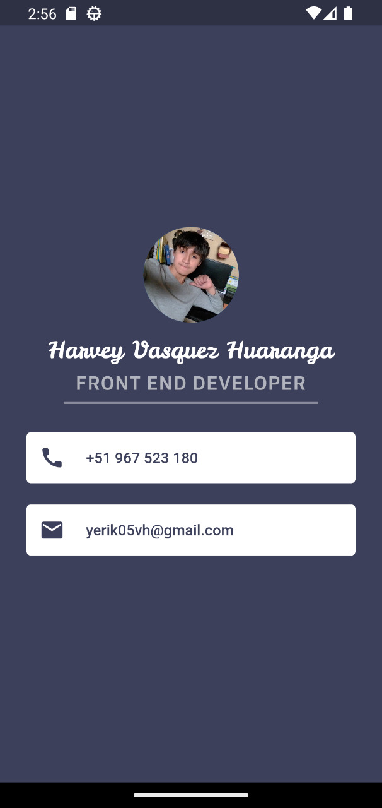

# my_card_flutter

My first mobile app that was developed in Flutter with the Dart programming language. It doesn't have much interaction, but it was helpful for me to understand more about widgets in Flutter.

## Development 🧱

The application theme is located in a `lib/theme/` folder,
All files are linked by `home_widget.dart` file, We can change the name, image, number and email. Since it is passed as an argument.

## Technologies used in the 🛠 project

- Flutter
- Dart

## Screenshots

